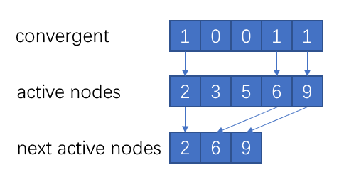
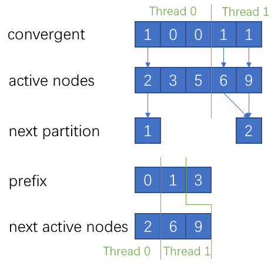

## 背景介绍

### PageRank

PageRank 是一个种判断节点影响力的网络分析算法。例如对论文引用网络，如果论文 $i$ 引用了 论文 $j$，则存在边从节点 $i$ 流入节点 $j$。其思想是：如果一个节点被引用得越多，该节点的影响力越大；如果一个节点被影响力大的节点引用，该节点的影响力也会比较大。用其数学表示为
$$
PR(i) = 1 - \alpha + \alpha \sum_{j \in N^-(i)} \frac{ PR(j) } {| N^+(j) |}
$$
其中 $\alpha$ 是常数（一般为0.85），$N^+(i)$ 和 $N^-(i)$ 分别是无向图中流出和流入节点 $i$ 的邻居的集合。

由于该定义是递归的，需要使用迭代的方式计算 $t$ 次直至 $PR_t[i]$ 收敛。
$$
PR_{t+1}[i] = 1 - \alpha + \alpha \sum_{j \in N^-(i)} \frac{ PR_t[j] } {| N^+(j) |}
$$

### 图数据结构

常用的无向图数据结构有 COO 格式和 CSR 格式。它们都是图邻接矩阵的稀疏表示法。

我们可将边的信息用两个数组 row 和 col 存储。第 $i$ 条边就记为从 row[i] 到 col[i]。这就是 COO 数据结构。

为了方便查找边，可以根据 row 进行排序，并添加索引数组 rowptr。如果 rowptr[n] <= i < rowptr[n + 1]，说明第 i 条边的起始节点是 row[i]，终点是 col[i]。由 rowptr 和 col 两个数组就可组成 CSR 数据结构。


## 实现内容

1. Synchronous。最简单的是同步方式，会将所有节点都迭代指定的次数。

2. Asynchronous。但是每个节点的收敛速度都不同，同步迭代会反复计算已经收敛的节点。而异步方式会通过 $| PR_{t+1}[i] - PR_{t}[i] | < \epsilon$ 判断收敛性，如果节点已经收敛，在下一次迭代中就不再计算。

3. Monte Carlo。除此之外还可以使用基于随机游走的 Monte Carlo 方法近似计算。随机游走类似深度优先搜索算法（但可重复访问），从起始节点出发，等概率随机选取一个流出的邻居或以 $1 - \alpha$ 的概率返回起始节点。我们在每个节点都进行给定步长 $l$ 的随机游走，得到每个节点被访问的次数 $v(i)$，PageRank 的近似值就是 $v(i) / l$ 。

代码共实现了**10个最终版本的PageRank算法**，分别是基于以上三种计算方法的**串行、OpenMP和CUDA实现**，以及基于Monte Carlo模拟的**多GPU+OpenMP**的版本。


## 同步迭代方法

### 串行

未优化的代码如下所示。使用 COO 数据结构。

```c++
void pagerank(const int nodes, const int edges, float* value, const int* rowdeg, const int* colptr, const int* row, const int* col)
{
    auto new_value = new float[nodes];

    for (int i = 0; i < iteration; i++) {
        for (int n = 0; n < nodes; n++) {
            new_value[n] = 1 - alpha;
        }

        for (int e = 0; e < edges; e++) {
            new_value[col[e]] += alpha * value[row[e]] / (float)rowdeg[row[e]];
        }

        for (int n = 0; n < nodes; n++) {
            value[n] = new_value[n];
        }
    }

    delete [] new_value;
}
```

### OpenMP

使用OpenMP加速的代码如下所示。最外层的for循环是迭代，需要基于之前的结果才能进行，不能并行化。而内部的 for 循环不存在数据依赖，可以并行化。其中 private 可以生成线程的私有变量。如果不同线程正在执行的边都指向统一节点，会出现更新不一致的问题，因此需要用 atomic 进行原子操作。

```c++
for (int i = 0; i < iteration; i++) {
    #pragma omp parallel for
    for (int n = 0; n < nodes; n++) {
        new_value[n] = 1 - alpha;
    }

    float message;
    #pragma omp parallel for private(message)
    for (int e = 0; e < edges; e++) {
        message = alpha * value[row[e]] / (float)rowdeg[row[e]];

        #pragma omp atomic
        new_value[col[e]] += message;
    }

    #pragma omp parallel for
    for (int n = 0; n < nodes; n++) {
        value[n] = new_value[n];
    }
}
```

### CUDA

为了能够**全局同步**，CUDA 代码的加速需要把一次迭代分为2个函数调用。第一步计算每条边所能提供的影响力（**一条边分配一个线程**），一个线程的时间复杂度为O(1)，

```c++
__global__ void compute(const int edges, float* value, float* message, const int* rowdeg, const int* row, const int* col) 
{
    const int tid = blockDim.x * blockIdx.x + threadIdx.x;

    if (tid < edges) {
        message[tid] = alpha * value[row[tid]] / (float)rowdeg[row[tid]];
    }
}
```

第二步把所有边的影响力进行累加（**一个点分配一个线程**），一个线程的时间复杂度为O(d)，其中d是点的入边数量。

```c++
__global__ void aggregate(const int nodes, float* value, float* message, const int* colptr) 
{
    const int tid = blockDim.x * blockIdx.x + threadIdx.x;

    if (tid < nodes) {
        float v = 1 - alpha;
        for (int e = colptr[tid]; e < colptr[tid + 1]; e++) {
            v += message[e];
        }
        value[tid] = v;
    }
}
```

算法的主函数，cudaMalloc 和 cudaFree 已省略。每个 block 分配 512 个线程。

```c++
const int threads_per_block = 512;

void pagerank(const int nodes, const int edges, float* value, const int* rowdeg, const int* colptr, const int* row, const int* col)
{
    //...
    cudaMemcpy(d_value, value, sizeof(float) * nodes, H2D);
    cudaMemcpy(d_rowdeg, rowdeg, sizeof(int) * nodes, H2D);
    cudaMemcpy(d_colptr, colptr, sizeof(int) * (nodes + 1), H2D);
    cudaMemcpy(d_row, row, sizeof(int) * edges, H2D);
    cudaMemcpy(d_col, col, sizeof(int) * edges, H2D);

    for (int i = 0; i < iteration; i++) {
        compute<<<edges/threads_per_block+1, threads_per_block>>>(edges, d_value, d_message, d_rowdeg, d_row, d_col);
        aggregate<<<nodes/threads_per_block+1, threads_per_block>>>(nodes, d_value, d_message, d_colptr);
    }

    cudaMemcpy(value, d_value, sizeof(float) * nodes, D2H);
   	//...
}
```


## 异步迭代方法

### 串行

未优化的代码如下所示。使用 COO 数据结构。我们把没有收敛的节点成为 active node。第一步计算新的PageRank值，之后根据收敛性生成新的 active nodes 集合，最后复制新的 PageRank值 和 active nodes。

```c++
for (int n = 0; n < nodes; n++) {
    active_nodes[n] = n;
}

while(true) {
    for (int n = 0; n < num_active_nodes; n++) {
        new_value[active_nodes[n]] = 1 - alpha;
        for (int e = colptr[active_nodes[n]]; e < colptr[active_nodes[n] + 1]; e++) {
            new_value[active_nodes[n]] += alpha * value[row[e]] / (float)rowdeg[row[e]];
        }
    }

    int num_next_nodes = 0;
    for (int n = 0; n < num_active_nodes; n++) {
        if (abs(value[active_nodes[n]] - new_value[active_nodes[n]]) > epsilon) {
            next_nodes[num_next_nodes++] = n;
        }
    }

    for (int n = 0; n < num_active_nodes; n++) {
        value[active_nodes[n]] = new_value[active_nodes[n]];
    }

    for (int n = 0; n < num_next_nodes; n++) {
        active_nodes[n] = active_nodes[next_nodes[n]];
    }

    num_active_nodes = num_next_nodes;

    if (num_active_nodes == 0)
        break;
}
```

### OpenMP

针对异步方式，**手动划分任务可以防止不同线程同时更新同一个节点的 PageRank 值，因此不需要 atomic 保护**。除此之外，PageRank 计算上的串行化和串行方法一样，不再重复说明。

由于每次迭代后 active nodes 都不同，因此每次迭代都需要划分。

下图为生成新的 active nodes 集合的算法示意图。



以下为生成新的 active nodes 集合（next_nodes）的串行代码，由于 num_next_nodes 的**存在数据依赖，不能直接并行**。其时间复杂度为 O(n)。

```c++
int num_next_nodes = 0;
for (int n = 0; n < num_active_nodes; n++) {
    if (abs(value[active_nodes[n]] - new_value[active_nodes[n]]) > epsilon) {
        next_nodes[num_next_nodes++] = n;
    }
}
```

这时，我们可以让每个线程记录自己的划分中那些节点是active nodes以及active nodes的数量（复杂度为O(n/p)）。通过active nodes的数量串行计算前缀和，从而得到该划分的第一个active nodes 该放在哪的索引 （复杂度为O(p)）。最后每个线程根据索引将 active nodes 加入 next_nodes 中（复杂度为O(p)）。最终的复杂度为 O(n/p)，成功实现了并行化。



```c++
int threads = omp_get_max_threads();
auto node_partition = new int[threads + 1];
auto next_partition = new int[threads + 1];

#pragma omp parallel shared(threads)
{
    const int tid = omp_get_thread_num();
    for (int n = node_partition[tid]; n < node_partition[tid + 1]; n++) {
        if (abs(value[active_nodes[n]] - new_value[active_nodes[n]]) > epsilon) {
            is_next_nodes[n] = 1;
            next_partition[tid + 1] += 1;
        }
        else {
            is_next_nodes[n] = 0;
        }
    }
}      

for (int i = 1; i <= threads; i++) {
    next_partition[i] += next_partition[i - 1];
}

#pragma omp parallel shared(threads)
{
    const int tid = omp_get_thread_num();
    int index = 0;
    for (int n = node_partition[tid]; n < node_partition[tid + 1]; n++) {
        if (is_next_nodes[n]) {
            next_nodes[next_partition[tid] + index] = active_nodes[n];
            index++;
        }
    }
}

num_active_nodes = next_partition[threads];
```

### CUDA

由于异步方式中并不是所有的边都指向 active nodes。因此每条边都分配一个线程效率较低。因此只针对一个 active node 分配一个线程。为了**避免多次访问全局变量**，分配了 shared memory。

```c++
__global__ void compute(const int num_active_nodes, int* active_nodes, float* value, float* new_value, const int* rowdeg, const int* colptr, const int* row, const int* col)
{
    const int tid = blockDim.x * blockIdx.x + threadIdx.x;
    __shared__ float tile[threads_per_block];
    tile[threadIdx.x] = 1 - alpha;

    if (tid < num_active_nodes) {
        int n = active_nodes[tid];
        for (int e = colptr[n]; e < colptr[n + 1]; e++) {
            tile[threadIdx.x] += alpha * value[row[e]] / (float)rowdeg[row[e]];
        }
        new_value[n] = tile[threadIdx.x];
    }
}
```

之后标记未收敛的节点，复制新的PageRank值。同样只针对一个 active node 分配一个线程。这里不使用共享内存，因为一个全局地址只使用一次的情况下，使用共享内存缓存反而会增加代价。

```c++
__global__ void find_active(const int num_active_nodes, int* active_nodes, float* value, float* new_value, int* is_next_nodes)
{
    const int tid = blockDim.x * blockIdx.x + threadIdx.x;

    if (tid < num_active_nodes) {
        int n = active_nodes[tid];
        is_next_nodes[tid] = abs(value[n] - new_value[n]) > epsilon? 1: 0;
    }
}

__global__ void copy_value(const int num_active_nodes, int* active_nodes, float* value, float* new_value)
{
    const int tid = blockDim.x * blockIdx.x + threadIdx.x;

    if (tid < num_active_nodes) {
        int n = active_nodes[tid];
        value[n] = new_value[n];
    }
}
```

注意到 is_next_nodes 中标记为 1 的才表示下一次迭代中的 active nodes 。为了让其凑在一起，我们需要计算前缀和。这里就用到了**thrust库中计算前缀和的函数 exclusive_scan**。

```c++
while (true) {
    compute<<<num_active_nodes/threads_per_block+1,threads_per_block>>>(num_active_nodes, d_active_nodes, d_value, d_new_value, d_rowdeg, d_colptr, d_row, d_col);
    find_active<<<num_active_nodes/threads_per_block+1,threads_per_block>>>(num_active_nodes, d_active_nodes, d_value, d_new_value, d_is_next_nodes);
    copy_value<<<num_active_nodes/threads_per_block+1,threads_per_block>>>(num_active_nodes, d_active_nodes, d_value, d_new_value);

    thrust::exclusive_scan(thrust::device, d_is_next_nodes, d_is_next_nodes + num_active_nodes + 1, d_is_next_nodes);
    coalesce_next_active<<<num_active_nodes/threads_per_block+1, threads_per_block>>>(num_active_nodes, d_active_nodes, d_next_nodes, d_is_next_nodes);

    cudaMemcpy(&num_active_nodes, &d_is_next_nodes[num_active_nodes], sizeof(int), D2H);

    if (num_active_nodes == 0)
        break;

    copy_active<<<num_active_nodes/threads_per_block+1,threads_per_block>>>(num_active_nodes, d_active_nodes, d_next_nodes);
}
```

如以下代码所示，如果前缀和出现不一致，说明该点是 active 的，它在下一次迭代中的 active nodes 中的索引就是前缀和。如以上主函数代码所示，前缀和最后一位就是下一次迭代中的 active nodes 的数量，但其在 GPU memory 中，需要用 cudaMemcpy 复制回来。如果其为0，那么迭代结束。

```c++
__global__ void coalesce_next_active(const int num_active_nodes, int* active_nodes, int* next_nodes, int* is_next_nodes)
{
    const int tid = blockDim.x * blockIdx.x + threadIdx.x;
    if (tid < num_active_nodes && is_next_nodes[tid] < is_next_nodes[tid + 1]) {
        next_nodes[is_next_nodes[tid]] = active_nodes[tid];
    }
}
```

copy_active 函数和 copy_value 函数类似。不再赘述。


## 蒙特卡洛方法

### 串行

串行代码如下所示。为了更方便寻找一个节点的邻居，使用CSR数据结构。首先初始化随机数生成器，然后以每个节点为起始点进行随机游走，计算近似PageRank值。对于大规模蒙特卡洛模拟，C语言的 rand() 函数会有一些偏差，这里使用C++的mt19937随机数生成器。

```c++
void pagerank(const int nodes, const int edges, float* value, const int* rowdeg, const int* rowptr, const int* row, const int* col) 
{
    std::random_device rand_dev;
    std::mt19937 generator(rand_dev());
    std::uniform_real_distribution<float> distribution(0.0,1.0);

    for (int n = 0; n < nodes; n++) {
        value[n] = 0.0;
    }

    for (int n = 0; n < nodes; n++) {
        int cur = n;
        for (int i = 0; i < length; i++) {
            if (distribution(generator) < alpha) 
                cur = rowdeg[cur] == 0? cur: col[rowptr[cur] + (int)(distribution(generator) * rowdeg[cur])];
            else 
                cur = n;

            value[cur] += 1;
        }
    }

    for (int n = 0; n < nodes; n++) {
        value[n] /= length;
    }
}
```

### OpenMP

由于随机数生成器是线程不安全的，因此我们把它设置为**线程的局部变量**。除此之外，不同线程可能会同时执行 value[cur] += 1 语句，但是很多高影响力节点的 value[cur] 更新会非常频繁，设置 critical 比较影响效率。因此每个线程都**分配了新的 new_value**，随机游走完成后再将其累加起来。

```c++
void pagerank(const int nodes, const int edges, float* value, const int* rowdeg, const int* rowptr, const int* row, const int* col) 
{
    int threads = omp_get_max_threads();
    auto new_value = new int[nodes * threads];

    #pragma omp parallel for
    for (int n = 0; n < nodes; n++) {
        value[n] = 0.0;
        for (int i = 0; i < threads; i++) {
            new_value[n * threads + i] = 0;
        }
    }

    #pragma omp parallel shared(threads)
    {
        std::random_device rand_dev;
        std::mt19937 generator(rand_dev());
        std::uniform_real_distribution<float> distribution(0.0, 1.0);
        
        const int tid = omp_get_thread_num();

        for (int n = tid; n < nodes; n += threads) {
            int cur = n;
            for (int i = 0; i < length; i++) {
                if (distribution(generator) < alpha) 
                    cur = rowdeg[cur] == 0? cur: col[rowptr[cur] + (int)(distribution(generator) * rowdeg[cur])];
                else 
                    cur = n;

                new_value[cur * threads + tid] += 1;
            }
        }
    }
        
    #pragma omp parallel for
    for (int n = 0; n < nodes; n++) {
        for (int i = 0; i < threads; i++) {
            value[n] += new_value[n * threads + i];
        }
        value[n] /= length;
    }

    delete [] new_value;
}
```

### CUDA

在CUDA中，我们同样需要对不同线程分配不同的随机数生成器MRG32k3a。但一个随机游走就要分配一个线程，随机数初始化代价太大。

但事实上，**一个 block 只会同时运行 WARP_SIZE = 32 个线程**，因此我们一个 block 分配 32 个随机数生成器即可。我们一个 block 分配 512 个线程，这样就将随机数生成器数量**减少到原来的 1/16** 。

```c++
__global__ void setup(const int nodes, float* value, curandStateMRG32k3a *state)
{
    const int tid = threadIdx.x + blockIdx.x * blockDim.x;

    if (tid < nodes) {
        value[tid] = 0;
    }
    if (threadIdx.x < WARP_SIZE) {
        int rid = threadIdx.x + blockIdx.x * WARP_SIZE;
        curand_init(0, rid, 0, &state[rid]);
    }
}
```

为了获得指定的随机数生成器，需要新的变量 rid。对于 value[cur] 的原子性，我们不可能像 OpenMP 一样分配 nodes * threads 大小的内存，因此使用了 **atomicAdd 函数**。

```c++
__global__ void random_walk(const int nodes, float* value, const int* rowptr, const int* col, curandStateMRG32k3a *state)
{
    const int tid = blockDim.x * blockIdx.x + threadIdx.x;
    const int rid = (threadIdx.x % WARP_SIZE) + blockIdx.x * WARP_SIZE;

    if (tid < nodes) {
        int cur = tid;
        for (int i = 0; i < length; i++) {
            int deg = rowptr[cur + 1] - rowptr[cur];
            if (curand_uniform(&state[rid]) < alpha)
                cur = deg == 0? cur: col[ rowptr[cur] + (int)(curand_uniform(&state[rid]) * deg) ];
            else
                cur = tid;

            atomicAdd(&value[cur], 1);
        }
    }
}
```

最后归一化 value。

```c++
__global__ void normalize(const int nodes, float* value)
{
    const int tid = blockDim.x * blockIdx.x + threadIdx.x;

    if (tid < nodes) {
        value[tid] /= length;
    }
}

void pagerank(const int nodes, const int edges, float* value, const int* rowdeg, const int* rowptr, const int* row, const int* col) {
    float *d_value;
    int *d_rowptr, *d_col;
    curandStateMRG32k3a *state;

    const int threads_per_block = 512;

    cudaMalloc(&state, sizeof(curandStateMRG32k3a) * (nodes / threads_per_block + 1) * WARP_SIZE);

    cudaMalloc(&d_value, sizeof(float) * nodes);

    cudaMalloc(&d_rowptr, sizeof(int) * (nodes + 1));
    cudaMalloc(&d_col, sizeof(int) * edges);

    cudaMemcpy(d_rowptr, rowptr, sizeof(int) * (nodes + 1), H2D);
    cudaMemcpy(d_col, col, sizeof(int) * edges, H2D);

    setup<<<nodes/threads_per_block+1, threads_per_block>>>(nodes, d_value, state);
    random_walk<<<nodes/threads_per_block+1, threads_per_block>>>(nodes, d_value, d_rowptr, d_col, state);
    normalize<<<nodes/threads_per_block+1, threads_per_block>>>(nodes, d_value);

    cudaMemcpy(value, d_value, sizeof(float) * nodes, D2H);

    cudaFree(state);
    cudaFree(d_value);
    cudaFree(d_rowptr);
    cudaFree(d_col);
}
```

### Multi-GPU + OpenMP

与之前的同步与异步迭代的方法不同，蒙特卡洛方法依赖的数据只有图。因此很容易扩展到多个GPU上并行。

多GPU的实现需要**Stream和异步拷贝**，为了防止异步操作过程中，操作系统改变CPU虚拟内存映射的物理地址，需要用 cudaHostRegister 和 cudaMallocHost 将这些**页面固定**。值得注意的是，cudaFree 是**强制同步**的函数，将16行和39行的for合并会阻碍16行循环中函数的多GPU并行。

最后每个GPU都计算得到一个PageRank值。最后用OpenMP取平均值得到最后的结果。

```c++
void pagerank(const int nodes, const int edges, float* value, const int* rowdeg, const int* rowptr, const int* row, const int* col) {
    int ngpus;
    cudaGetDeviceCount(&ngpus);

    float **d_value = new float*[ngpus];
    float **h_value = new float*[ngpus];
    cudaStream_t* streams = new cudaStream_t[ngpus];

    int **d_rowptr = new int*[ngpus];
    int **d_col = new int*[ngpus];
    curandStateMRG32k3a **state = new curandStateMRG32k3a *[ngpus];

    cudaHostRegister((void *)rowptr, sizeof(int) * (nodes + 1), 0);
    cudaHostRegister((void *)col, sizeof(int) * edges, 0);

    for (int i = 0; i < ngpus; i++) 
    {
        cudaSetDevice(i);
        cudaStreamCreate(&streams[i]);

        cudaMalloc(&state[i], sizeof(curandStateMRG32k3a) * (nodes / threads_per_block + 1) * WARP_SIZE);

        cudaMalloc(&d_value[i], sizeof(float) * nodes);
        cudaMallocHost(&h_value[i], sizeof(float) * nodes);

        cudaMalloc(&d_rowptr[i], sizeof(int) * (nodes + 1));
        cudaMalloc(&d_col[i], sizeof(int) * edges);

        cudaMemcpyAsync(d_rowptr[i], rowptr, sizeof(int) * (nodes + 1), H2D, streams[i]);
        cudaMemcpyAsync(d_col[i], col, sizeof(int) * edges, H2D, streams[i]);

        setup<<<nodes/threads_per_block+1, threads_per_block, 0, streams[i]>>>(nodes, d_value[i], state[i]);
        random_walk<<<nodes/threads_per_block+1, threads_per_block, 0, streams[i]>>>(nodes, d_value[i], d_rowptr[i], d_col[i], state[i]);
        normalize<<<nodes/threads_per_block+1, threads_per_block, 0, streams[i]>>>(nodes, d_value[i]);

        cudaMemcpyAsync(h_value[i], d_value[i], sizeof(float) * nodes, D2H, streams[i]);
    }
    
    for (int i = 0; i < ngpus; i++) {
        cudaFree(d_value[i]);
        cudaFree(state[i]);
        cudaFree(d_rowptr[i]);
        cudaFree(d_col[i]);
    }

    cudaHostUnregister((void *)rowptr);
    cudaHostUnregister((void *)col);
    
    #pragma omp parallel for
    for (int i = 0; i < nodes; i++) {
        value[i] = 0;
        for (int j = 0; j < ngpus; j++) {
            value[i] += h_value[j][i] / ngpus;
        }
    }
    
    for (int i = 0; i < ngpus; i++) {
        cudaFreeHost(h_value[i]);
    }
}
```


## 实验配置

### 运行环境

串行与OpenMP代码运行环境：

CPU：AMD R5-4650u 6核12线程 

操作系统：Manjaro 20 

编译器：g++ 9.3

CUDA代码运行环境：

GPU：3 个 Nvidia GTX 1080Ti 

操作系统：Ubuntu 16

编译器：CUDA nvcc 10.1

### 数据集

| 数据集      | 点的数量  | 边的数量   | 预处理后的文件大小 | 下载地址                                            |
| ----------- | --------- | ---------- | ------------------ | --------------------------------------------------- |
| Stanford    | 281,903   | 2,312,497  | 17.6 MB            | http://snap.stanford.edu/data/web-Stanford.html     |
| Google      | 875,713   | 5,105,039  | 38.9 MB            | http://snap.stanford.edu/data/web-Google.html       |
| LiveJournal | 4,847,571 | 68,993,773 | 526.4 MB           | http://snap.stanford.edu/data/soc-LiveJournal1.html |

### 常数设定

同步迭代方法需要循环迭代50次。

异步迭代方法的收敛判断系数为0.0015。

蒙特卡洛方法中随机游走的步长为100。

### 运行方法

下载数据集并解压，使用 txt2bin.py 进行数据预处理。以下是对 LiveJournal 数据集的处理。

```bash
python3 txt2bin.py $your-dir/soc-LiveJournal.txt datasets/livejournal.bin
```

src/main.cc 是主程序，其余在 sync，async，mc中实现了10种不同的 PageRank 算法。对 C++ 程序使用以下命令编译。

```bash
g++ -o pagerank -fopenmp src/main.cc src/sync/sync-omp.cc
```

对 CUDA 程序使用以下命令编译。

```bash
nvcc -o pagerank -lgomp src/main.cc src/sync/sync-cuda.cu
```

数据集处理完成后，使用以下命令运行程序。

```bash
./run.sh stanford
./run.sh google
./run.sh livejournal
```


## 实验结果

### OpenMP

同步迭代方法

| 数据集      | 串行运行时间 / ms | OpenMP运行时间 / ms | 加速比 | 并行效率 |
| ----------- | ----------------- | ------------------- | ------ | -------- |
| Stanford    | 971.215           | 171.395             | 5.667  | 47.2%    |
| Google      | 7,987.464         | 1,155.931           | 6.910  | 57.6%    |
| LiveJournal | 75,723.439        | 13,858.527          | 5.464  | 45.5%    |

异步迭代方法

| 数据集      | 串行运行时间 / ms | OpenMP运行时间 / ms | 加速比 | 并行效率 |
| ----------- | ----------------- | ------------------- | ------ | -------- |
| Stanford    | 109.514           | 25.229              | 4.341  | 36.2%    |
| Google      | 565.509           | 92.898              | 6.087  | 50.7%    |
| LiveJournal | 4,735.188         | 1,467.805           | 3.226  | 26.9%    |

蒙特卡洛方法

| 数据集      | 串行运行时间 / ms | OpenMP运行时间 / ms | 加速比 | 并行效率 |
| ----------- | ----------------- | ------------------- | ------ | -------- |
| Stanford    | 3,226.083         | 361.433             | 8.926  | 74.4%    |
| Google      | 10,337.430        | 1,091.464           | 9.471  | 78.9%    |
| LiveJournal | 89,090.255        | 9,611.646           | 9.269  | 77.2%    |

### CUDA

同步迭代方法

| 数据集      | 串行运行时间 / ms | CUDA运行时间 / ms | 加速比 |
| ----------- | ----------------- | ----------------- | ------ |
| Stanford    | 971.215           | 246.438           | 3.941  |
| Google      | 7,987.464         | 351.740           | 22.71  |
| LiveJournal | 75,723.439        | 1,642.867         | 46.09  |

异步迭代方法

| 数据集      | 串行运行时间 / ms | CUDA运行时间 / ms | 加速比 |
| ----------- | ----------------- | ----------------- | ------ |
| Stanford    | 109.514           | 350.279           | 0.3126 |
| Google      | 565.509           | 261.965           | 2.159  |
| LiveJournal | 4,735.188         | 552.588           | 8.569  |

蒙特卡洛方法

| 数据集      | 串行运行时间 / ms | CUDA运行时间 / ms | 加速比 |
| ----------- | ----------------- | ----------------- | ------ |
| Stanford    | 3,226.083         | 228.589           | 14.11  |
| Google      | 10,337.430        | 321.242           | 32.18  |
| LiveJournal | 89,090.255        | 1,139.699         | 78.17  |

单GPU和多GPU蒙特卡洛方法对比

| 数据集      | 多GPU运行时间 / ms | 单GPU运行时间 / ms | 多GPU代价 |
| ----------- | ------------------ | ------------------ | --------- |
| Stanford    | 265.953            | 228.589            | 1.163     |
| Google      | 361.779            | 321.242            | 1.126     |
| LiveJournal | 1,167.545          | 1,139.699          | 1.024     |


## 总结

蒙特卡洛方法的并行效率最高，同步迭代方法其次，异步迭代方法的并行效率较差。蒙特卡洛方法并行效率较高的原因在于数据依赖较少，更计算密集型。异步迭代方法在后期迭代的计算量相对较少，线程分配的代价会更明显，同时线程间同步操作较多，这都会降低并行效率。

较大的数据集在GPU上运行，加速会更明显。

多GPU会增加微小的代价，但会让蒙特卡洛模拟的标准差变为原来的 $\frac{1}{\sqrt{N}}$ （实验中 $N = 3$）, 相对而言是值得的。

因为图网络数据结构有**随机访问**的特性，在 GPU 上很难做内存上的优化。相比图像处理等更加**规则访问**的应用而言，GPU 的加速比没有特别高。

